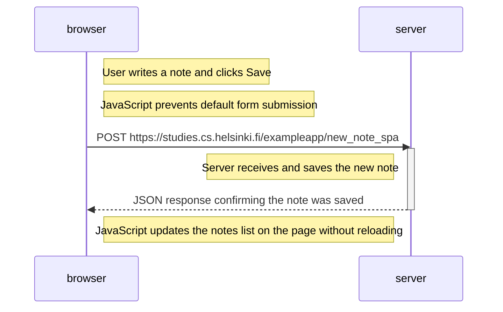

```mermaid
sequenceDiagram
    participant browser
    participant server

    Note right of browser: User writes a note and clicks Save

    Note right of browser: JavaScript prevents default form submission

    browser->>server: POST https://studies.cs.helsinki.fi/exampleapp/new_note_spa
    activate server
    Note left of server: Server receives and saves the new note
    server-->>browser: JSON response confirming the note was saved
    deactivate server

    Note right of browser: JavaScript updates the notes list on the page without reloading
```
